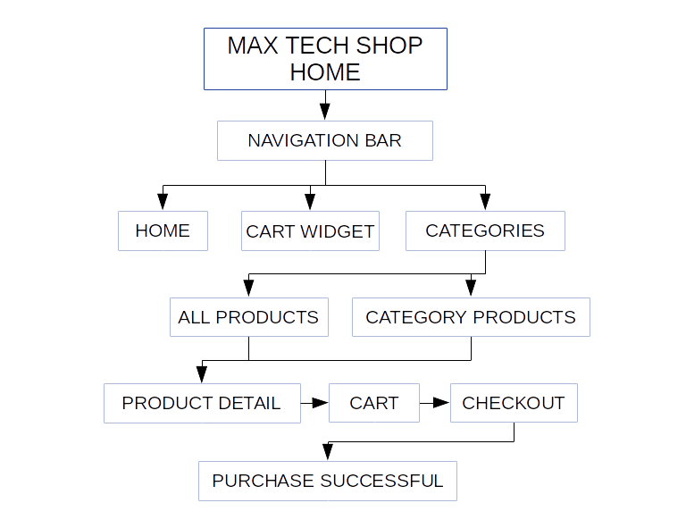

# MAX-TECH-SHOP

A fake e-commerce about tech and gaming products, designed and buided with a Javascript library React.js for education purpose.

This project was bootstrapped with [Create React App](https://github.com/facebook/create-react-app).

## Motivation

I want to become an excellent front-end web developer and React.js is the main one library that I would like to learn and specialize. 

## Features

MAX-TECH-SHOP App is able to show a list of products by category and details like a real e-commerce place. This web app is a SPA that can be navigate with links that let you go to other views and also mimic the behavior of an app requesting to an end point with a delay of response and a loading component. 

## Schema

## Requirements

+ [Node.js](https://nodejs.org/)
+ [React](https://facebook.github.io/react/)
+ [SASS](https://sass-lang.com/)
+ [React-Router-Dom](https://reactrouter.com/web/guides/quick-start)

## Build status

The project is still in progress an this is the first delivery.

## Clone and Getting Started
  
    git clone https://github.com/MaxCarmonaG/max-tech-shop
    cd max-tech-shop
    yarn
    yarn start

## Available Scripts

In the root folder, you can run:

### `yarn start`

### `yarn test`

### `yarn build`
